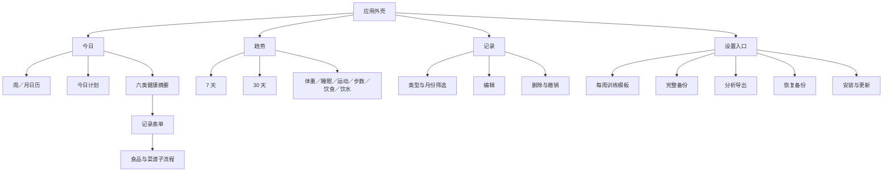

# HealthLife UX 交互说明与审查

## 文档信息

- 文档用途：描述当前产品的页面结构、关键交互、状态反馈和异常处理，并记录 UX 审查结论。
- 基准版本：`acd48a1 feat: 增加工作日约束与训练计划联动`
- 审查日期：2026-07-30
- 主要验收视口：390×844
- 产品边界：个人、本地优先的健康记录与趋势观察工具，不提供医疗诊断、账号、云同步或公司考勤管理。

## 1．体验目标

HealthLife 当前围绕三个核心任务组织体验：

1. 快速记录当天或历史日期的健康数据。
2. 结合工作安排获得当天训练与恢复建议。
3. 通过短期趋势和完整导出观察生活习惯。

交互设计遵循以下原则：

- 以手机单手操作为主要场景。
- 高频记录入口集中在“今日”。
- 计划与实际记录分开保存，避免计划自动变成健康事实。
- 所有正式数据保存在当前浏览器，写入失败时不得假装成功。
- 删除提供短时间撤销；备份恢复在覆盖前显示摘要并保护当前数据。
- 营养、Apple Watch 热量等数据明确作为估算或手动抄录结果展示。

## 2．信息架构

一级导航固定为“今日、趋势、记录”。“数据”位于顶部，不占用一级导航位置。

## 3．全局交互规则

### 3.1 日期语境

- 应用默认选择用户本地自然日的今天。
- 日历以周一为一周起点，默认显示 7 天，可展开为固定 6 周的月视图。
- 历史日期可选择和补录。
- 未来日期可以选择并设置计划，但六类健康记录和快捷饮水入口会禁用。
- 选择历史日期后，页面标题显示“X月X日”，“回到今天”重新选择今天。
- 日历每天显示六类健康记录的完成数量，不包含健康计划。

### 3.2 导航

- 底部导航固定显示三个入口。
- 切换页面时滚动到页面顶部。
- 趋势页固定以今天为窗口结束日期，不跟随首页所选日期。
- 记录页保留当前筛选条件，用户可手动清除。

### 3.3 保存与反馈

- 保存成功后关闭当前表单，并通过底部 Toast 提示结果。
- 保存失败时保留表单内容，在表单内显示错误。
- 正式数据先完成整体校验和本地写入，成功后才替换页面状态。
- 页面没有网络加载过程；正常情况下不展示加载骨架。

### 3.4 弹窗

- 健康记录、当天计划、自定义食品、自制菜谱和设置均使用原生模态弹窗。
- 健康记录表单具备未保存内容保护：关闭、点击遮罩或按 Esc 时，如果内容有变化，会要求确认是否放弃。
- 健康记录、当天计划、每周训练模板、自定义食品和自制菜谱关闭前都会检查未保存内容。
- 记录表单的主保存按钮在移动端保持底部吸附。

### 3.5 本地数据异常

- 当前存储不可用时，页面阻止新增记录和计划修改。
- 当前 v5 数据损坏时保留原始内容，停止写入，并提供原始内容下载入口。
- schema v5 使用独立存储键，不读取或迁移旧 schema；旧键不会被删除。

## 4．“今日”页面

### 4.1 日期与连续记录

日期面板包含：

- 当前日期语境。
- 连续记录天数。
- 上一周／月、下一周／月。
- 周视图或月视图。
- 展开／收起日历。
- 历史日期下的“回到今天”。

连续记录按“每天至少有一类健康记录”计算。今天尚未记录时，连续天数可以保留到昨天，不因当天尚未完成而立即归零。

### 4.2 今日计划

计划卡展示：

- 工作日类型。
- 执行状态。
- 当天有效训练。
- 根据下班时间生成的训练与恢复建议。
- 需要时显示晚餐建议。

默认每周模板：

| 星期 | 默认训练 |
| --- | --- |
| 周一 | 休息 |
| 周二 | 力量 A |
| 周三 | 休息 |
| 周四 | 力量 B |
| 周五 | 休息 |
| 周六 | 跑走结合 |
| 周日 | 休息 |

当天可选择的工作类型：

| 类型 | 建议逻辑 |
| --- | --- |
| 正常工作日 | 按周模板训练，状态不足时可缩短 |
| 加班至 19:20 | 力量或跑走计划可缩短为 20～30 分钟 |
| 加班至 19:50 | 建议取消正式训练，优先晚餐、放松和睡眠 |
| 加班至 20:20 | 建议取消正式训练，优先晚餐、放松和睡眠 |
| 周末加班 | 建议休息并手动改期 |
| 休息日 | 按身体状态执行模板并保留恢复 |

当天训练可以覆盖周模板，执行状态包括：

- 计划中。
- 已完成。
- 缩短完成。
- 已改期。
- 休息。

“已改期”必须选择另一个日期。系统同时保存来源与目标计划：原日期显示目标，目标日期显示来源；目标已有训练安排时先确认覆盖。

### 4.3 六类健康摘要

| 类型 | 首页摘要 | 快捷行为 |
| --- | --- | --- |
| 运动 | 次数和总分钟 | 打开运动表单 |
| 每日活动 | 当日步数 | 新增或编辑当天唯一记录 |
| 饮食 | 餐数和营养汇总 | 打开饮食表单 |
| 睡眠 | 时长和质量 | 新增或编辑当天唯一记录 |
| 体重 | 当日体重 | 新增或编辑当天唯一记录 |
| 饮水 | 当日毫升数 | `＋250`、`＋500` 或打开详情 |

睡眠、体重、饮水和每日活动每天最多一条；再次进入时直接编辑。运动和饮食允许同日多条。

## 5．健康记录表单

所有记录表单共享日期字段。用户可以从当前选择日期进入表单，也可以在表单中再次修改记录日期。

### 5.1 运动

- 类型：力量、跑步、其他有氧、步行、拉伸、球类、其他。
- 数据来源：手动或 Apple Watch 摘要。
- 快捷时长：15、30、45、60 分钟。
- 强度：低、中、高。
- 可选设备摘要：活动热量、平均心率、最高心率和距离。
- 只有跑步、步行和有氧支持距离。
- 时长和距离完整时实时计算平均配速。
- Apple Watch 数据只表示手动抄录，不表示已连接 HealthKit。

### 5.2 每日活动

- 记录当日总步数。
- 数据来源为 Apple Watch 或手动。
- 每个日期最多一条，重复录入进入编辑。

### 5.3 饮食

饮食是当前交互层级最深的表单：

1. 选择餐次。
2. 选择称重记录或外食估算。
3. 选择可信度。
4. 从食物目录选择食物。
5. 输入克数；水煮鸡蛋可切换为“个”。
6. 可收藏食物并加入本餐。
7. 查看本餐营养估算。
8. 选择健康程度和饱腹感。
9. 保存整餐。

精确称重模式禁止使用低可信度。每项食物加入本餐后显示份量和营养估算，可在保存前移除。

辅助流程：

- 新建食品：填写名称、状态和每 100 克营养值。
- 新建菜谱：逐项添加原料、填写成品熟重，实时计算整道菜和每 100 克营养。
- 最近使用和收藏会影响食物目录排序。

### 5.4 睡眠

- 记录按起床日期归档。
- 输入入睡和起床时间后实时预览时长。
- 支持跨日睡眠。
- 两个时间相同会显示错误，不解释为 24 小时。
- 记录主观质量、夜醒次数和备注。

### 5.5 体重

- 体重以 kg 输入。
- 体脂率可选。
- 每个日期最多一条，已有记录直接进入编辑。

### 5.6 饮水

- 首页可直接增加 250 ml 或 500 ml。
- 详情表单同样提供快捷增加。
- 达到单日上限时阻止写入并显示错误。

## 6．“趋势”页面

趋势固定提供最近 7 天和最近 30 天：

| 模块 | 主要信息 |
| --- | --- |
| 体重 | 最新值、区间变化、7 日均重、上一周期比较 |
| 睡眠 | 样本数、平均时长、平均质量、上一周期比较 |
| 运动 | 次数、总时长、类型分布、设备摘要、上一周期比较 |
| 每日活动 | 有记录日期的日均步数、累计步数、上一周期比较 |
| 饮食 | 日均蛋白质、热量、脂肪、碳水、精确／估算餐数 |
| 饮水 | 有记录日期的日均饮水量、上一周期比较 |

趋势规则：

- 缺失日期不补零。
- 当前和上一周期都有样本时才展示差值。
- 完全无数据时显示统一空状态和“去记录”入口。
- 体重图的数据点支持点击、键盘聚焦和 Enter／Space 查看详情。
- 运动和饮食默认展示核心趋势，设备摘要和辅助营养指标通过“更多指标”展开。
- 页面底部明确说明趋势不构成健康诊断。

## 7．“记录”页面

- 所有正式健康记录按日期倒序分组。
- 日期标题滚动时吸顶。
- 支持类型与月份组合筛选。
- 筛选后显示“当前数量／全部数量”。
- 空记录状态提供“去记录”；筛选无结果提供“显示全部记录”。
- 每条记录提供编辑入口。
- 删除收纳在“更多”菜单中，不再直接暴露高风险按钮。
- 删除后提供 10 秒撤销，撤销成功后恢复删除前的完整数据状态。

健康计划进入“记录”列表，并支持按“健康计划”和月份筛选。

## 8．设置、备份与恢复

当前顶部入口文案为“设置”，弹窗按健康计划和本地数据安全组织以下能力：

1. 每周训练模板。
2. 完整 JSON 备份与分析 JSON 导出。
3. 完整恢复。
4. PWA 安装和更新说明。

### 8.1 完整备份

- 导出 schema v5 完整数据。
- 备份状态记录最近导出时间和当时的健康记录数。
- 从未备份、超过 14 天或新增至少 10 条健康记录时提示备份。

### 8.2 分析导出

- 按自然日输出计划状态、运动、步数、饮食、睡眠、体重和饮水。
- 用于后续人工或 AI 趋势分析。

### 8.3 恢复

1. 选择 JSON 文件。
2. 严格校验格式、版本、字段、范围和唯一性。
3. 展示导出时间、日期范围、健康记录总数和分类数量。
4. 明确说明将完整替换当前数据。
5. 当前有健康记录时，覆盖前自动下载安全备份。
6. 主数据写入成功后才切换页面状态。

恢复预览展示每日计划数量、每周训练模板和工作日类型摘要。

## 9．PWA 与离线状态

- 首次在线加载后缓存完整应用外壳。
- 导航请求在线优先，离线时回退到缓存首页。
- 静态资源使用缓存。
- 新缓存激活后清理旧版本。
- 检测到更新后显示“立即刷新”，刷新不会主动删除本地数据。
- 支持通过浏览器菜单或数据弹窗安装到主屏幕。

## 10．可访问性与移动端基线

当前已具备：

- 页面和弹窗使用标题关联。
- 表单控件有可访问标签。
- 选中日期使用 `aria-pressed`。
- 趋势周期使用 `aria-pressed`。
- 错误使用 `role="alert"`，Toast 使用 `role="status"`。
- 表单输入字号为 16px，避免移动浏览器自动放大。
- 常规可见按钮不低于 44px。
- 390px 视口没有横向溢出。
- 体重图数据点支持键盘操作。

已发现的例外：

- 删除后的“撤销”按钮实测高度为 40px。
- 体重图圆点半径为 4px，视觉和指针命中区域偏小。

## 11．UX 审查方法

本次审查结合：

- `docs/index.html` 的页面语义和控件结构。
- `docs/app.js` 的状态管理、事件、保存、关闭和反馈路径。
- `docs/planning.js`、`interaction.js` 的计划与交互规则。
- `model.js`、`storage.js`、`backup.js` 的失败保护。
- 390×844 真实浏览器操作。

手机视口实测：

- 日期面板高度约 307px。
- 今日计划卡高度约 202px。
- 首个健康摘要从约 637px 开始，844px 首屏能看到运动、每日活动和部分饮食。
- 页面宽度和滚动宽度均为 390px。
- 浏览器控制台无警告或错误。

## 12．当前体验做得较好的部分

### 12.1 数据安全反馈完整

保存失败不切换状态、异常数据不覆盖、恢复前预览、覆盖前备份，这些行为符合本地优先产品最重要的信任要求。

### 12.2 历史补录语境清晰

日历选择、页面标题和表单日期保持一致，睡眠明确按起床日期归档，减少了历史补录时的日期误解。

### 12.3 高频行为已有快捷入口

运动快捷时长、饮水快捷增加、每日唯一记录直接编辑，能减少重复输入。

### 12.4 高风险删除采用“弱确认＋可撤销”

删除藏在“更多”中，又提供 10 秒撤销，比每次弹确认框更适合个人高频记录工具。

### 12.5 趋势对缺失数据保持克制

不补零、不虚构样本、不输出医疗结论，符合健康产品的表达边界。

## 13．基准审查问题与处理结果

以下问题来自 `acd48a1` 基准审查。第 1～10 项、第 12 项和第 13 项已在 schema v5 交互优化中处理；食品目录维护仍保留为后续评估。

| 编号 | 当前处理结果 |
| --- | --- |
| 1 | 未来日期开放计划，健康记录和快捷饮水禁用 |
| 2 | 跨日期保存后自动切换到实际保存日期 |
| 3 | 改期建立来源／目标双向关系；目标冲突必须确认覆盖 |
| 4 | 匹配运动与计划状态互相提示，但不自动修改事实 |
| 5 | 计划、模板、自定义食品和菜谱统一提供未保存保护 |
| 6 | 日历显示计划标记，“记录”和“趋势”补充计划回顾 |
| 7 | 备份提醒和恢复预览纳入计划变化 |
| 8 | 顶部入口改为“设置”，保留三个一级导航 |
| 9 | 撤销按钮和体重数据点命中区达到 44px |
| 10 | 压缩计划卡片间距和辅助文字 |
| 12 | 快捷饮水复用 10 秒撤销 |
| 13 | 运动和饮食趋势默认展示核心指标，辅助指标按需展开 |

### P0：阻断性问题

当前未发现会导致主要流程无法完成的 P0 问题。

### P1：已处理

#### 1．计划功能无法选择未来日期

**现状**

日历会禁用所有未来日期。这个规则适用于健康记录，但也同时阻断了工作安排和训练计划。

**影响**

- 无法提前安排下周加班。
- “已改期”可以填写未来目标日期，但用户无法打开目标日期检查或调整。
- 计划功能只能成为当天备注，不能真正承担计划作用。

**建议**

- 允许选择未来日期。
- 未来日期只开放“计划”，禁用六类健康记录入口和饮水快捷增加。
- 日历分别显示“已有计划”和“已有实际记录”。

#### 2．跨日期保存后仍停留在原日期

**现状**

用户从今天打开记录表单，在表单里把日期改为昨天并保存，页面仍停留在今天。实测保存运动到 7 月 29 日后，首页仍选中 7 月 30 日并显示“尚未记录”。

**影响**

保存成功与页面结果看起来矛盾，用户容易重复录入或怀疑保存失败。

**建议**

- 推荐方案：保存后自动切换到实际保存日期。
- 备选方案：Toast 显示“已保存到 7 月 29 日”，并提供“查看”按钮。

#### 3．“已改期”只有来源日期，没有目标日期接续

**现状**

原日期显示“已改至某日”，目标日期不会自动生成训练覆盖、来源说明或待执行状态。

**影响**

改期任务容易丢失，目标日期也无法解释训练从何而来。

**建议**

- 建立来源计划与目标计划的关联。
- 保存改期时预览目标日期现有训练，发现冲突时让用户选择替换、并列或取消。
- 目标日期展示“由 X 月 X 日改期而来”。

该项已通过 schema v5 实现；按用户确认，当前无正式数据，因此没有增加旧版本迁移和备份兼容。

#### 4．计划完成状态与实际运动记录可能矛盾

**现状**

用户可以把力量训练标为“已完成”，但不需要存在对应运动记录；也可能已经记录运动，计划仍保持“计划中”。

**影响**

计划完成率和实际运动统计可能产生两套互相矛盾的事实。

**建议**

- 保持计划和记录分离，但增加关联提示。
- 标记“已完成”时，如果没有当天运动记录，提示“是否同时记录运动”。
- 已有符合类型的运动记录时，提示用户确认计划状态。
- 不应在没有用户确认时自动生成运动记录。

### P2：已处理

#### 5．计划和模板缺少未保存内容保护

**现状**

当天计划或每周模板修改后，点击关闭会直接丢弃内容，不出现确认。实测当天状态从“已改期”临时改为“已完成”后关闭，弹窗直接消失。

**建议**

- 将健康记录已有的表单签名和放弃确认机制复用到计划、每周模板、自定义食品和菜谱。
- 关闭时只有内容真正变化才提示。

#### 6．计划无法集中回顾

**现状**

健康计划只在具体日期的首页卡片中出现，不进入“记录”或“趋势”，日历也不显示计划状态。

**建议**

- 记录页增加“计划”筛选，或提供独立的计划历史。
- 趋势页后续显示计划完成、缩短、改期和休息次数。
- 明确区分“计划完成率”和“实际运动量”。

#### 7．备份提醒和恢复预览没有覆盖计划语境

**现状**

- 备份提醒只根据健康记录数量变化触发。
- 恢复预览不展示每日计划数、每周模板和工作类型。

**影响**

用户只调整训练模板和工作安排时，可能长期收不到备份提醒；恢复时也无法判断计划将如何被替换。

**建议**

- 备份元数据增加计划更新时间或计划变更数。
- 恢复预览显示每日计划数量、每周模板和工作日类型分布。

#### 8．“数据”入口的信息架构已经过载

**现状**

顶部按钮和弹窗标题都是“数据”，但弹窗第一部分是每周训练模板。

**建议**

- 顶部入口改为“设置”。
- 弹窗拆成“健康计划”和“数据安全”两个清晰分组。
- 保持一级导航仍为三个入口，不新增底部导航项。

#### 9．少数触控目标低于项目标准

**现状**

- 删除撤销按钮高度为 40px。
- 体重图数据点半径为 4px。

**建议**

- 撤销按钮提升到至少 44px。
- 体重图保留小圆点视觉，但增加透明的 44×44 命中区域，或在图下提供可点击的数据点列表。

#### 10．首页首屏纵向密度开始升高

**现状**

390×844 下，日历和计划卡合计占据约 521px，饮食摘要只在首屏底部部分出现。

**建议**

- 保留当前周日历，不恢复已移除的重复日期信息。
- 工作安排未设置时压缩计划卡说明。
- 已设置后只展示一条主建议，晚餐提醒可折叠或合并。
- 不建议为了压缩而移除日历或计划卡，它们仍是首页核心上下文。

### P3：可随真实使用反馈评估

#### 11．食品目录增长后的查找和维护（待评估）

当前依赖收藏与最近使用排序，没有搜索，也不能编辑或删除自定义食品和菜谱。个人数据量较小时可接受，目录增长后会降低效率。

#### 12．饮水快捷增加没有撤销（已处理）

误触 `＋250` 或 `＋500` 后只能进入详情修改。可以考虑复用 Toast 撤销，但优先级低于计划闭环和跨日期保存反馈。

#### 13．趋势文本在样本丰富后偏密（已处理）

运动和饮食会把多项指标放在同一段文字中。后续可以把核心指标与辅助指标分层，但不应在样本不足时增加更多空卡片。

## 14．推荐优化顺序

### 第一轮：补齐计划闭环

1. 未来日期可选择但不可写入健康记录。
2. 改期在目标日期形成接续关系。
3. 计划状态与实际运动记录提供确认式关联。
4. 日历显示计划状态。

### 第二轮：减少误操作和认知冲突

1. 跨日期保存后跳转或提供“查看”。
2. 为计划、模板、食品和菜谱增加未保存保护。
3. “数据”入口调整为“设置”，重新分组健康计划和数据安全。
4. 恢复预览和备份提醒覆盖计划变化。

### 第三轮：移动端细节

1. 修正撤销按钮和图表数据点触控区域。
2. 适度压缩计划卡。
3. 增加食品搜索与自定义内容管理。
4. 优化趋势信息层级。

## 15．后续交互变更的验收重点

- 未来日期可以设置计划，但所有健康记录按钮必须明确禁用。
- 计划改期不能产生重复、循环或孤立关系。
- 计划完成不能未经确认自动生成实际运动记录。
- 跨日期保存后，用户必须能立刻知道记录保存到了哪一天。
- 所有可编辑弹窗关闭时都应一致处理未保存内容。
- 计划变化必须进入完整备份、恢复摘要和必要的备份提醒。
- 390px 视口无横向溢出，高频触控目标不低于 44px。
- 键盘和屏幕阅读器可以识别日期选择、计划状态和图表数据点。
- 所有新增建议仍然属于生活方式提示，不输出医疗诊断。

## 16．相关实现文件

| 文件 | UX 职责 |
| --- | --- |
| `docs/index.html` | 页面、表单、弹窗和可访问语义 |
| `docs/styles.css` | 手机布局、触控尺寸、状态颜色和弹窗样式 |
| `docs/app.js` | 页面状态、事件、渲染、保存、删除、备份和反馈 |
| `docs/interaction.js` | 日期语境、默认餐次、快捷饮水、筛选和恢复文案 |
| `docs/planning.js` | 工作日类型、训练模板和当天建议 |
| `docs/calendar.js` | 周／月日历、完成状态和连续记录 |
| `docs/stats.js` | 7 天／30 天趋势与上一周期比较 |
| `docs/model.js` | schema v5 以及所有输入和跨对象校验 |
| `docs/storage.js` | v5 本地加载和写入失败保护 |
| `docs/backup.js` | 完整备份、恢复摘要和备份提醒 |
| `docs/sw.js` | 离线应用外壳和更新版本 |
